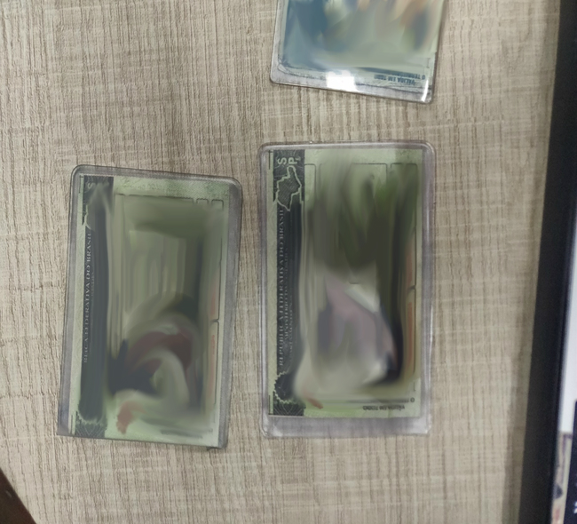
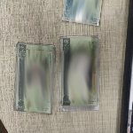
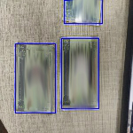

# Resize-pascal-voc
It's a package to resize ALL your dataset images (into local folder) and change the pascal_VOC coodinates in your .xml file

# Index

- [How it works?](#How-it-works?)
- [Warnings](#Warnings)
- [Install requirements](#Install-requirements)
- [Usage](#Usage)
- [Example](E#xample)
- [Folder structure example](#Folder-structure-example)
- [Results](#Results)
    - [Original Image](#Original-Image)
    - [Resized image](#Resized-image)
    - [Boundies box image](#Boundies-box-image)
- [Parameters](#Parameters)

### How it works?
- Walk by paths and searching by .jpg and .xml files
- Resize the image and change the XY coordinates of each object in xml file.
- Save the new files into output path. [Folder structure example](#Folder-structure-example) for more details
- If save_box_images = 1, draw the boundies box in the resized image and save it in an other file(output_path/boxes_images/))

## Warnings
1º: Don't worry about if you has a big folder structure with many folders inside many folders, the package will walk recursively in your dataset folder and recreate the same structure into output_path.

2º: The .jpg and .xml files must be in the same folder

## Install requirements
```
pip install -r requirements.txt
```

## Usage
```
python3 main.py -p <IMAGES_&_XML_PATH> --output <IMAGES_&_XML> --new_x <NEW_X_SIZE> --new_y <NEW_X_SIZE> --save_box_images <FLAG>"
```

## Example
```
python3 main.py -p /home/italojs/Pictures/dataset --output ./output --new_x 150 --new_y 150 --save_box_images 1
```

## Folder structure example

Look this *randon* folder structure with ALL my dataset
```
dataset
├── IMG_20181109_165212.jpg
├── IMG_20181109_165212.xml
├── IMG_20181109_165213.jpg
├── IMG_20181109_165213.xml
├── test
│   ├── IMG_20181109_163524.jpg
│   ├── IMG_20181109_163524.xml
│   ├── IMG_20181109_163525.jpg
│   └── IMG_20181109_163525.xml
├── train
│   ├── class1
│   │   ├── IMG_20181109_162519.jpg
│   │   ├── IMG_20181109_162519.xml
│   │   ├── IMG_20181109_162523.jpg
│   │   └── IMG_20181109_162523.xml
│   ├── class2
│   │   ├── IMG_20181109_162814.jpg
│   │   ├── IMG_20181109_162814.xml
│   │   ├── IMG_20181109_162818.jpg
│   │   └── IMG_20181109_162818.xml
│   ├── IMG_20181109_163315.jpg
│   ├── IMG_20181109_163315.xml
│   ├── IMG_20181109_163316.jpg
│   └── IMG_20181109_163316.xml
└── validation
    ├── IMG_20181109_164824.jpg
    ├── IMG_20181109_164824.xml
    ├── IMG_20181109_164825.jpg
    └── IMG_20181109_164825.xml
```

After executed the package with:
```
python3 main.py -p /home/italojs/Pictures/dataset --output ./output --new_x 200 --new_y 200 --save_box_images 1
``` 
The package will resize the images, rewrite the xml files and create the same folder structure into `output path` with new images and xml files.
``` 
output
├── boxes_images
│   ├── boxed_IMG_20181109_165212.jpg
│   └── boxed_IMG_20181109_165213.jpg
├── IMG_20181109_165212_new.jpg
├── IMG_20181109_165212_new.xml
├── IMG_20181109_165213_new.jpg
├── IMG_20181109_165213_new.xml
├── test
│   ├── IMG_20181109_163524_new.jpg
│   ├── IMG_20181109_163524_new.xml
│   ├── IMG_20181109_163525_new.jpg
│   └── IMG_20181109_163525_new.xml
├── train
│   ├── class1
│   │   ├── IMG_20181109_162519_new.jpg
│   │   ├── IMG_20181109_162519_new.xml
│   │   ├── IMG_20181109_162523_new.jpg
│   │   └── IMG_20181109_162523_new.xml
│   ├── class2
│   │   ├── IMG_20181109_162814_new.jpg
│   │   ├── IMG_20181109_162814_new.xml
│   │   ├── IMG_20181109_162818_new.jpg
│   │   └── IMG_20181109_162818_new.xml
│   ├── IMG_20181109_163315_new.jpg
│   ├── IMG_20181109_163315_new.xml
│   ├── IMG_20181109_163316_new.jpg
│   └── IMG_20181109_163316_new.xml
└── validation
    ├── IMG_20181109_164824_new.jpg
    ├── IMG_20181109_164824_new.xml
    ├── IMG_20181109_164825_new.jpg
    └── IMG_20181109_164825_new.xml
```

## Results

### Original Image
Here wee have the original image (650x590) an your xml:



``` xml
<annotation>
  <folder>imagens</folder>
  <filename>IMG_20181109_165212</filename>
  <path>[IMAGE_PATH]\IMG_20181109_165212.jpg</path>
  <source>
    <database>Unknown</database>
  </source>
  <size>
    <width>650</width>
    <height>590</height>
    <depth>3</depth>
  </size>
  <segmented>0</segmented>
  <object>
    <name>CNH</name>
    <pose>Unspecified</pose>
    <truncated>0</truncated>
    <difficult>0</difficult>
    <bndbox>
      <xmin>74</xmin>
      <ymin>192</ymin>
      <xmax>267</xmax>
      <ymax>499</ymax>
    </bndbox>
  </object>
  <object>
    <name>CNH</name>
    <pose>Unspecified</pose>
    <truncated>0</truncated>
    <difficult>0</difficult>
    <bndbox>
      <xmin>297</xmin>
      <ymin>168</ymin>
      <xmax>483</xmax>
      <ymax>478</ymax>
    </bndbox>
  </object>
  <object>
    <name>CNH</name>
    <pose>Unspecified</pose>
    <truncated>0</truncated>
    <difficult>0</difficult>
    <bndbox>
      <xmin>310</xmin>
      <ymin>1</ymin>
      <xmax>499</xmax>
      <ymax>103</ymax>
    </bndbox>
  </object>
</annotation>
```

### Resized image
Here is the resized image (200x200) and new xml:



```xml
<annotation>
  <folder>imagens</folder>
  <filename>IMG_20181109_165212</filename>
  <path>C:\Users\pc-casa\Music\imagens\IMG_20181109_165212.jpg</path>
  <source>
    <database>Unknown</database>
  </source>
  <size>
    <width>650</width>
    <height>590</height>
    <depth>3</depth>
  </size>
  <segmented>0</segmented>
  <object>
    <name>CNH</name>
    <pose>Unspecified</pose>
    <truncated>0</truncated>
    <difficult>0</difficult>
    <bndbox>
      <xmin>17</xmin>
      <ymin>49</ymin>
      <xmax>62</xmax>
      <ymax>127</ymax>
    </bndbox>
  </object>
  <object>
    <name>CNH</name>
    <pose>Unspecified</pose>
    <truncated>0</truncated>
    <difficult>0</difficult>
    <bndbox>
      <xmin>69</xmin>
      <ymin>43</ymin>
      <xmax>111</xmax>
      <ymax>122</ymax>
    </bndbox>
  </object>
  <object>
    <name>CNH</name>
    <pose>Unspecified</pose>
    <truncated>0</truncated>
    <difficult>0</difficult>
    <bndbox>
      <xmin>72</xmin>
      <ymin>0</ymin>
      <xmax>115</xmax>
      <ymax>26</ymax>
    </bndbox>
  </object>
</annotation>
```

### Boundies box image

here is the resized image (200x200), but with the boundies box drawed:



## Parameters
To know more about parameters use `python bot.py -h`:
```
usage: bot.py [-h] -e EMAIL -p PASSWORD -k KEYWORDS [-i INITIAL_PAGE]              [-las LAST_PAGE] [-c CHROME_DIR] [-lan LANGUAGE]

optional arguments:
  -h, --help            show this help message and exit
  -e EMAIL, --email EMAIL
                        Your linkedin e-mail
  -p PASSWORD, --password PASSWORD
                        Your linkedin password
  -k KEYWORDS, --keywords KEYWORDS
                        Your search word
  -i INITIAL_PAGE, --initial_page INITIAL_PAGE
                        page's number where will be started the crawller in
                        search page
  -las LAST_PAGE, --last_page LAST_PAGE
                        Quantity of pages to crawller in search
  -c CHROME_DIR, --chrome_dir CHROME_DIR
                        path to google chrome bin, example: /bin/google-chrome
  -lan LANGUAGE, --language LANGUAGE
                        accept pt-br or en(default)
```